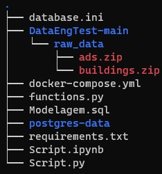

# DataEng
Para esse desafio, foram criados os seguintes arquivos:<br>


## Descrição dos arquivos

**database.ini** -> arquivo com os dados para conexão do banco de dados<br>
**docker-compose.yml** -> arquivo com o serviço para o banco de dados "Kzas"<br>
**requirements.txt** -> arquivo com as bibliotecas necessárias para a execução do script python<br>
**script.ipynb** -> script python em formato notebook para download, inclusão e geração dos dataset enriquecido no banco de dados<br>
**script.py** -> versão do script em python.<br>
**modelagem.sql** -> script sql para criação das tabelas.<br>

## Execução
Para execução do script, é necessario a instalação do docker e python.<br><br>
1. No diretorio, onde os arquivos estão localizados, execute: <br>
```docker-compose up -d```
2. depois execute: <br>
  ``` python Script.py ```

Apos a execução do script, será gerado 3 tabelas no banco de dados: <br>

**ads** -> tabela com os dados de ads mais **"id_building"** no qual e feito o relacionamento com a tabela **"buildings"**<br>
**buildings** -> tabela com os dados de "buildings.csv"<br>
**ads_buildings** -> tabela com os registros de 1 ad para "n" registros de buildings

## Relacionamentos

**ads.id_building** -> **buildings.id** <br>
**ads.id** -> **ads_buildings.id_ad** <br>
**buildings.id** -> **ads_buildings.id_build**


## Questões

**Is your solution able to find a building for every ad? Don't worry if it's 100%, but can you explain why?** <br>

A solução nao foi capaz de encontrar um registro de predio para cada registro de "ad".<br>
O dataset de ad contem 10000 registros e foram encontrados 8025 registros com associado ao um unico registro no dataset "buildings" pois possuem o mesmo endereço, numero cidade, estado e em alguns casos tambem o bairro. <br>
Esses registros estão identificados com a informação de "id_building" na tabela "ads".<br><br>
Há 539 registros de "ads", que foram associados a mais de um registro na tabela "buildings". Esses registros estão na tabela ads_building.<br><br>
No dataset "ads", há 1436 registros que nao foram associados no dataset "buidlings".

**What would you do differently if you had more time?**

Abaixo, alguns pontos visando melhorar a associação dos registros de ads e buildings:<br>

* Atualizar as informaçoes referentes a lat e lon para os 2 datasets, com uma api de geolocalizacao, utilizando os dados de endereços.
* Padronizar as variaveis como "address", "neighborhood", "city" e "cep".
* Atualizar os registros de cep para corrigir as informaçoes como bairro por exemplo, para evitar registros de predios com mesmo endereço e bairros diferentes. 
* Atualizar as informaçoes de "address","address_number" atraves das variaveis de "lat" e "lon"
* algumas ferramentas que podem ser usadas para essas tarefas:
    * unidecode -> para retirada de acentuação
    * googlemaps -> para busca de informações em relação ao endereço e geolocalização

*Importante destacar que para o dataset de ads a informaçao do bairro muitas vezes nao é a mesma que está cadastrada nos correios. Acredito que isso aconteça devido aos anunciantes informarem o nome da região mais conhecida.*
